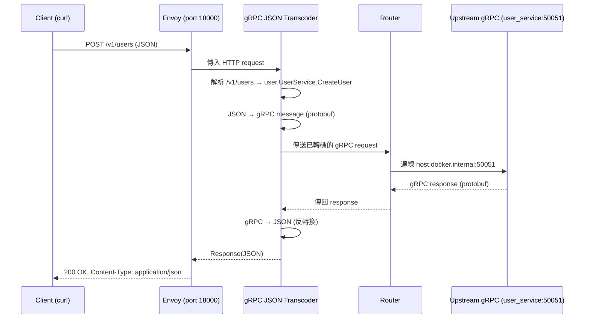

# intro
使用 grpc_json_transcoder 直接把 http json 制式化轉成 grpc request

# pre-requirement
會先需要在 user proto 上面以 annotation 寫好預設轉到 http 上的 url path, 讓 grpc_json_transcoder 參考，如下的 option 部分就是
```proto
service UserService {
  // 建立使用者 (POST /v1/users)
  rpc CreateUser(CreateUserRequest) returns (CreateUserResponse) {
    option (google.api.http) = {
      post: "/v1/users"
      body: "*"
    };
  }

  // 取得單一使用者 (GET /v1/users/{id})
  rpc GetUser(GetUserRequest) returns (GetUserResponse) {
    option (google.api.http) = {
      get: "/v1/users/{id}"
    };
  }

  // 列出所有使用者 (GET /v1/users)
  rpc ListUsers(ListUsersRequest) returns (ListUsersResponse) {
    option (google.api.http) = {
      get: "/v1/users"
    };
  }

  // 刪除使用者 (DELETE /v1/users/{id})
  rpc DeleteUser(DeleteUserRequest) returns (DeleteUserResponse) {
    option (google.api.http) = {
      delete: "/v1/users/{id}"
    };
  }
}
```
再來用 buf 轉出 .pb 給 envoy plugin 用
```shell
# 轉出 user.pb
buf build --path src/proto/user \
 -o deploy/gateway/envoy/wasm-plugin/plugins/grpc/user.pb

# 同時要先把 grpc 起起來
/var/local/apisvc
```

# envoy.yaml
流程如下

從 log 看 `grpc_json_transcoder` 的確在 envoy 中實作
- POST /v1/users -> gRPC user.UserService.CreateUser
- request body: json -> grpc
- response body: grpc -> json

# run
```shell
pluginDir=plugins/grpc
pluginPath=$(pwd)/${pluginDir}

# 沒有 wasm, 是使用 envoy 內建 filter, 直接 docker compose up
FOLDER_PLUGIN=${pluginPath} docker-compose up
```

# test
```shell
curl -X POST -v http://localhost:18000/v1/users \
  -H "Content-Type: application/json" \
  -d '{"name":"Alice","email":"alice@example.com"}'
```

# extension
如果同時要設定兩個以上的 http -> grpc, 並且需經過 grpc_json_transcoder 的話，可能要經過設定多個 cluster 來做 route, 所以
- 是不是能透過 wasm 自己做好 grpc_json_transcoder 這件事？
- 是否可以直接在 wasm 直接 call grpc 來略過 envoy.yaml 的複雜設定
